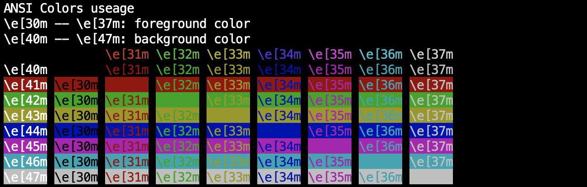
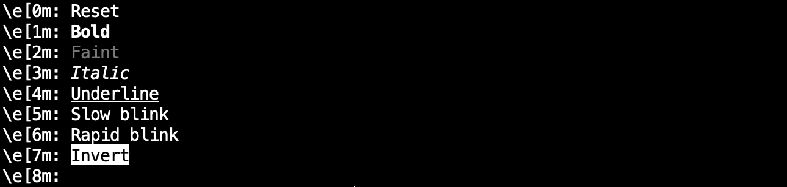

# ANSI escape

## color

### file

color/main.c

### abstract

To flash ANSI color, use `\e[XXm` where XX is numbers such that
satisfies 30 <= XX <= 37 or 40 <= XX <= 47.

### execution

## letter

### file

letter/main.c

### abstract

To set display attributes, use `\e[XXm` where XX is numbers such that
statisfies 0 <= XX <= 8.

### execution

